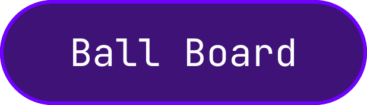
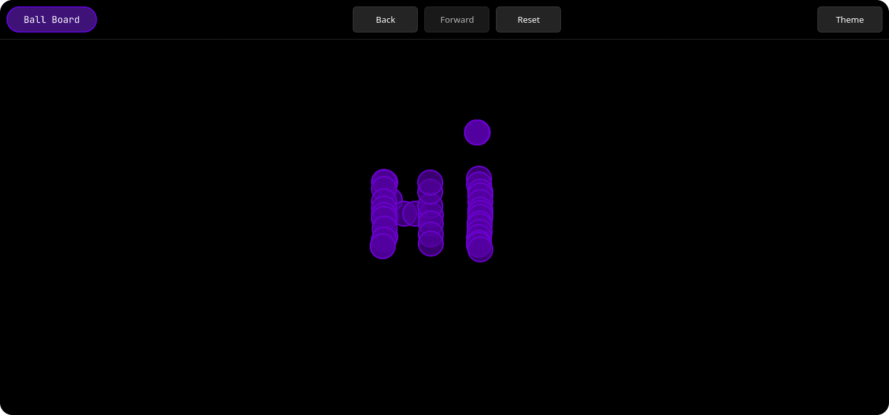

# Ball Board

<div align="center">



</div>

**Ball Board** is a simple page written in React for creating balls within your screen, with a create, return and reset function. This is a project to test the learning acquired in React, the focus is on being a simple and functional application, so it's an environment for study.

## About

The project was done entirely in react + vite + typescript, so just by getting **node.js** you can already use and test the project. The system consists of a simple screen, with a header that groups together all the board's functionalities and other features. The board is just a black, fully clickable screen. Each time the user clicks on the board, a new circle appears on the screen, so you can draw or test other functions.

<div>

  

<div>

## How to run

To run the project, the only requirement is to have **node.js** and **npm** on your machine. 

First, `clone` the project on your computer and enter the folder using VsCode or another program of your choice:

```bash
git clone https://github.com/devcavalcant/ball-board.git

cd ball-board

code . # Or other
```

Inside the project, run `npm i` to install all the dependencies. Finally, run the command `npm run dev` to run the application. 

```bash
npm i

npm run dev
```

